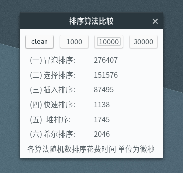

GTK_sort_demo
=============

一个使用GTK+编写的图形化算法速度比较程序

#### 介绍
本小程序使用GTK+-2.0编写，通过Makefile组织，在Linux环境下编译运行，通过图形化的方式显示各个主流算法的排序时间



点击上面的所需排序数字的个数，等待片刻即可

#### 说明
为了公平的对待各个算法，程序使用内存拷贝保证各个算法所排数据一致性
并且使用随机函数随机生成待排序数据，使得每次点击所排数据不同

#### 使用
直接在目录中键入`make`即可自行编译生成可执行文件`main`

```Bash
./main #Bash
```

